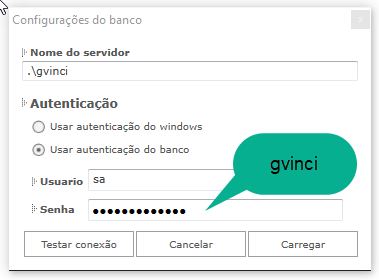

# Configuração do Banco de Dados

Quando for utilizar o **Gvinci** pela primeira vez, você não precisa definir as configurações de banco de dados da ferramenta.

Os parâmetros de configuração já foram inseridos quando ocorreu a instalação do **Gvinci**, que inclui a instalação e configuração do SQL Server 2012 Express.

O SQL Server é usado pelo **Gvinci** para armazenar as definições dos projetos, ou seja, para exibir toda a estrutura criada nas definições de bancos, tabelas e campos no **Gvinci**. Os dados preenchidos na tela exibida abaixo devem corresponder aos mesmos dados cadastrados no SQL Server. Para testar a conexão ao banco de dados e consultar seus dados, você poderá utilizar-se do SQL Server Management Studio, que permite acessar toda a estrutura do servidor com seus bancos e tabelas, exibindo todas as suas propriedades.

A tela **"Configurações do banco"** é exibida em duas situações:

**1.** Após clicar na opção "Reconfigurar servidor", na tela de Login do **Gvinci**:

**2.** Após clicar no botão **"Configurar banco"**, no painel Banco de dados do **Gvinci:**

            Em ambos os casos teremos esta tela, então preencha os campos necessários conforme as explicações a seguir:

**Nome do servidor:** Neste campo você deve inserir o nome do servidor de banco de dados. Você pode usar por exemplo o seguinte servidor:

                             **• .\gvinci**

O ponto \( **.** \) significa servidor local \(da própria máquina\) e **gvinci** é a instância padrão criada na instalação do SQL Server.

Qualquer outro servidor SQL Server 2008 ou um servidor SQL mais recente pode ser utilizado.

**Autenticação:** Define o tipo de autenticação com o banco:

                                   • Usar autenticação do Windows \(Trusted Connection = True\).                                   • Usar autenticação do banco \(Trusted Connection = False\).

         Ao marcar esta opção, será necessário inserir o nome do usuário e a senha que foram cadastrados durante a instalação do SQL Server.                                                  **• Usuário:** Insira aqui o nome de usuário cadastrado no servidor de banco de dados.                                                  O usuário padrão de administrador do SQL Server é "sa" \(System Administrator\).

                                                  **• Senha:** A senha padrão já cadastrada durante a instalação e configuração do SQL Server 2012 Express, que ocorreu durante a instalação do **Gvinci**, é **"gvinci"**

Use o botão  para testar a conexão antes de abrir o banco de dados. Caso a conexão seja efetivada, a mensagem abaixo será exibida:

Com o sucesso da conexão, clique no botão .

Após preencher os dados, clique em .

Na primeira conexão com o servidor, o **Gvinci** irá criar um banco de dados chamado **GvinciSys**. Para se certificar disso, abra o Management Studio, do Microsoft SQL Express. Observe a figura abaixo:

A cada nova solução criada, um novo banco de dados é criado, abaixo do banco GvinciSys. Na figura acima, a primeira solução criada resultou na criação do banco GvinciUser\_68, pois o nome não foi definido no **Gvinci**.

